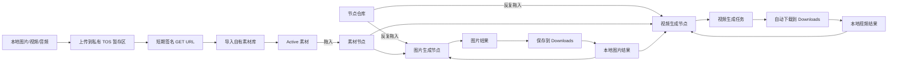

# AI 图片与视频生成画布 MVP

状态：产品草案 v0.20

## 产品目标

让用户在无限画布上通过节点组合 AI 生成请求：从远程素材库拖入参考素材，从节点仓库拖入提示词生成与优化、图片或视频生成节点，调用文本模型整理提示内容，再连接媒体输入执行远程模型，并把生成结果继续用于后续生成。

MVP 验证的基础闭环是：

> 素材入库 → 拖入画布 → 连接请求参数 → 执行生成 → 保存并复用结果

## 已确认的产品边界

- 第一版只接入公司自有产品，不接入第三方聚合平台或第三方素材库。
- 第一批接口以指定的五份第一方文档为准。
- 素材库按供应商连接使用的令牌隔离，存放图片、视频和音频；素材节点必须保存自己的来源供应商连接。
- 用户可以把素材从素材库拖到画布中，作为生成请求的参数。
- 新建画布初始为空，不预置任何节点或素材。节点仓库提供提示词生成与优化、图片生成节点和视频生成节点三个模板。
- 素材、提示词节点和两类媒体生成节点都可以反复拖入画布，不限制同一素材或同一模板的实例数量；每个画布实例拥有独立节点 ID。
- 图片生成节点与视频生成节点都自带提示词输入框；独立提示词节点可生成或优化提示词，并把输出连接到任一图片或视频生成节点。输入框支持通过 `@` 插入对已连线具体素材实例的结构化精确引用。
- 提示词节点提供“打斗导演”技能模式，内置 Fight Prompt Master V0.2 的完整方法与参考文档。沿用文本模型、参考图片/视频联系表、多轮参数补充和当前可编辑输出；默认交付三套强度方案，支持指定单版、选定方案继续优化与单变量诊断。目标视频格式在对话中选择 SD2.0、SD2.5 或 H3；本节点交付文字，后续媒体生成仍由图片/视频节点执行。
- 提示词节点提供“多宫格分镜”技能模式，将创意、剧本或参考图加剧情整理为 4/6/9 宫格的图片和视频两套提示词。交付保留时长与台词预算、剧本资产准备清单、逐格位置对应和整体生成指令；参数通过原有对话补充，当前输出可手改并继续优化。只规划文字，实际图片、视频和资产生成由用户另行执行。
- 提示词节点提供“故事板”技能模式，整合 14 份叙事、商业传播和视觉开发资料，按用途输出可直接交给图片节点的完整整张故事板提示词，保留版式、逐格画面与跨格一致性。支持文字需求、真实图片/视频参考、多轮对话、手改后优化及画布恢复；图片由用户在图片节点执行生成。
- 模型接口按照媒体传入顺序识别位置，但图片、视频和音频分别计数：`图片1…N`、`视频1…N`、`音频1…N` 是三套独立顺序，不存在跨类型的全局“素材 N”。
- 全部已连线素材实例按稳定连线顺序占据输入位置，同一实例只占一个位置；`@` 只表达提示语义，不改变位置或角色。
- 生成节点内部固定保留供应商、模型和生成数量。
- 全局设置允许输入每条供应商连接的 `base_url` 与 API Key，并通过 `GET /v1/models` 拉取、搜索和选择该连接开放的图片或视频模型。
- 供应商连接与模型定义分开管理；同一协议下的共享模型只维护一套请求逻辑，不按供应商复制节点或模型定义。
- 所有生成操作都先创建独立的本地异步生成任务；应用不设置任务并发上限或本地等待队列，同一节点可以同时运行多笔任务。
- 生成任务一旦创建就不支持取消、停止或暂停；节点和任务界面不提供相应操作。
- TOS 暂存上传流程开始后同样不支持取消、停止或暂停；只允许在开始前从待上传列表移除文件。
- 生成供应商调用遇到网络错误或 HTTP `500–599` 时，在同一任务内自动指数退避重试 3 次并提醒用户；其他错误不自动重试。
- 每笔生成任务无论成功、失败、结果未知或进程中断都永久保留在当前画布的任务历史中，并展示冻结请求、每次实际调用和完整原始返回。
- 图片和视频生成成功后都不导入公司素材库；应用立即把每个结果保存到操作系统 Downloads 目录下的“无限画布”子目录。
- 图片接口没有远程任务 ID，图片文件名使用本地生成任务 ID 与从 `1` 开始的结果序号；视频文件名直接使用供应商返回的远程 `task_id`，不按供应商创建子目录。
- 其他端口和节点内设置完全由所选模型的真实请求参数决定。
- MVP 暂不围绕故事、场景、分镜或时间线组织功能。

## 第一批自有接口

| 文档                                                              | MVP 职责                               | 主要端点                                                            |
| ----------------------------------------------------------------- | -------------------------------------- | ------------------------------------------------------------------- |
| [图片生成](https://doc.moyu.info/495380766e0.md)                  | 同步文生图并返回图片结果               | `POST /v1/images/generations`                                       |
| [图片编辑](https://doc.moyu.info/497391425e0.md)                  | 同步图生图并返回 Base64 图片结果       | `POST /v1/images/edits`                                             |
| [Seedance 2.0 / 2.5 视频生成](https://doc.moyu.info/9280779m0.md) | 提交视频生成并查询单个任务             | `POST /v1/video/generations`、`GET /v1/video/generations/{task_id}` |
| [按令牌获取视频任务列表](https://doc.moyu.info/9280780m0.md)      | 恢复和筛选当前令牌的视频任务历史       | `GET /v1/video/tasks`                                               |
| [素材库](https://doc.moyu.info/9280781m0.md)                      | 素材库分组、素材导入、查询、更新和删除 | `/v1/assets/*`                                                      |

第一版在节点仓库中只提供一个图片生成模板。该节点没有图片输入时使用纯文字图片生成，有已连线图片输入时使用图片参考生成；节点界面必须显示当前操作，任务快照必须冻结实际操作及对应 Adapter，不能在提交后重新推断。两种操作的参数、传输格式和结果结构仍分别按真实接口处理。

## 统一供应商模块

第一版使用统一供应商模块执行生成。多个供应商只要使用相同的请求与响应协议，就共用同一个 Adapter Implementation；每个供应商连接只提供自己的 `base_url` 和 API Key 凭据引用。节点和模型定义中不复制供应商地址、密钥或请求函数。

三个对象分开保存：

| 对象           | 保存内容                                                                               | 不保存                           |
| -------------- | -------------------------------------------------------------------------------------- | -------------------------------- |
| 供应商连接     | 稳定 ID、显示名称、Adapter ID、`base_url`、API Key 凭据引用、启用状态                  | 模型参数、节点输入、API Key 明文 |
| 模型定义       | 稳定模型 ID、显示名称、远程模型 ID、支持的操作及每种操作的输入端口、参数定义、结果类型 | `base_url`、API Key、供应商名称  |
| 供应商模型绑定 | 供应商连接 ID、模型定义 ID、开放的操作、是否启用；必要时保存该供应商使用的远程模型别名 | 重复的端口定义和参数定义         |

详细 Interface 和运行规则见 [统一供应商模块设计](./provider-module-design.md)。核心不变量是：

- 生成节点只保存 `provider_connection_id` 和 `model_definition_id`，不保存 API Key 明文。
- 供应商下拉框实际选择“供应商连接”；模型下拉框只显示该连接已经绑定并支持当前节点操作的模型。
- 切换到另一个也绑定了当前模型的供应商连接时，保留当前模型、提示词、生成参数、图片顺序、视频顺序、音频顺序和全部连线。
- 新供应商没有当前模型时，把节点标为“当前供应商未提供该模型”并阻止无法组装的请求，但不清空当前模型、参数或连线。
- 相同 Adapter 下的不同供应商不得出现按名称分支，例如 `if (provider === "A")`；差异只能来自连接配置。
- 如果某个供应商的端点、字段、鉴权或响应语义不再兼容，必须使用不同 Adapter ID，不能继续假装只有地址和密钥不同。
- 生成任务提交时冻结实际使用的 Adapter ID、`base_url`、API Key 凭据引用和远程模型 ID；后续修改供应商连接不能把已经运行的任务改指向新地址。
- API Key 由 Tauri 后端在执行时通过凭据引用读取，不能进入画布文件、节点快照、前端状态、错误面板或诊断导出。
- 素材的 `asset://` 引用只在拥有它的令牌范围内有效；跨供应商执行时必须通过来源供应商连接解析素材，不能把该引用直接交给另一份 API Key。

## 第一版核心闭环



用户上传的本地素材可以通过火山引擎 TOS 暂存区取得短期可访问 URL，再导入公司素材库。生成结果采用另一条链路：文生图和图生图结果直接保存为本地图片文件，视频结果直接下载为本地视频文件，均不调用素材导入接口。图生图输入可以从素材库读取字节，也可以直接读取本地图片结果；本地结果只有在后续远程接口必须接收公网 URL 时才按需经过 TOS，且不创建素材记录。

## MVP 画布对象与节点类型

| 画布对象         | 创建来源 | 职责                                                                                   |
| ---------------- | -------- | -------------------------------------------------------------------------------------- |
| 图片素材节点     | 素材库   | 引用 `Active` 图片素材，可连接到图片生成、首尾帧或参考图输入                           |
| 视频素材节点     | 素材库   | 引用 `Active` 视频素材，可连接到参考视频输入                                           |
| 音频素材节点     | 素材库   | 引用 `Active` 音频素材，可连接到参考音频输入                                           |
| 本地图片结果节点 | 生成结果 | 引用自动保存的图片结果，可本地预览并连接到图片输入                                     |
| 本地视频结果节点 | 生成结果 | 引用自动保存的视频结果，可本地预览并连接到参考视频输入                                 |
| 提示词节点       | 节点仓库 | 调用文本模型生成或优化提示词；图片素材可连入做视觉理解，输出可连接到图片或视频生成节点 |
| 图片生成节点     | 节点仓库 | 自带提示词输入，组装并执行纯文字图片生成或 multipart 图片参考生成请求                  |
| 视频生成节点     | 节点仓库 | 自带提示词输入，通过头部向右播放图标组装并执行视频生成请求                             |

节点仓库不提供其他生成模板。新画布不自动创建上述任何对象；素材卡片和生成模板每次拖入都创建新实例，同一来源或模板可无限重复。

生成成功的图片和视频都成为本地生成结果，在任务历史和画布结果中引用本机文件；它们不会自动成为公司素材库中的素材。

## 生成节点提示词与 `@` 精确引用

每个图片或视频生成节点都在自身提示词输入框中保存由文字片段和原子媒体引用组成的结构化提示内容。用户输入 `@` 后打开引用选择器，并从已经连入该生成节点的素材实例中选择一个确切对象；编辑器显示 `@显示名称` 芯片，但持久化的是目标画布节点 ID 及其来源身份。

### 可选择的引用来源

| 已连线实例来源 | 引用身份                                                        | 选择器辅助信息                                            |
| -------------- | --------------------------------------------------------------- | --------------------------------------------------------- |
| 公司素材节点   | `canvasNodeKey + providerConnectionId + assetId`                | 缩略图、媒体类型、素材名、分组、来源供应商、画布实例短 ID |
| 本地图片结果   | `canvasNodeKey + generationTaskId + resultIndex`                | 缩略图、结果序号、来源任务、内容哈希、画布实例短 ID       |
| 本地视频结果   | `canvasNodeKey + generationTaskId + resultIndex + remoteTaskId` | 关键帧、时长、来源任务、远程 `task_id`、画布实例短 ID     |

选择器只搜索当前生成节点的已连线实例，并支持按名称、素材 ID、任务 ID 和画布实例短 ID 过滤。名称相同、来源相同但画布节点 ID 不同的实例不能合并；列表必须同时显示媒体类型、缩略图、来源和实例短 ID。素材改名只更新芯片显示，不改变引用；目标实例断线、被删除、失去权限或本地文件缺失时，芯片保留原位并显示失效状态，不能静默删除或改指向同名对象。

### 结构化提示内容

概念数据形态如下：

```ts
type PromptSegment =
  | { kind: "text"; text: string }
  | {
      kind: "media_reference";
      mentionId: string;
      canvasNodeKey: string;
      target:
        | { kind: "asset"; providerConnectionId: string; assetId: string }
        | { kind: "local_asset"; stagingJobId: string }
        | { kind: "local_result"; generationTaskId: string; resultIndex: number }
        | { kind: "local_file"; path: string };
      displayNameSnapshot: string;
    };
```

- `mentionId` 标识这一次 `@` 出现；复制同一个媒体引用或再次选择同一媒体时仍可以形成不同的引用出现位置。
- `canvasNodeKey` 标识当前生成节点已经连线的具体画布实例；`target` 同时冻结公司素材、本地素材或本地生成结果的来源身份。所有 target variant（包括 `local_result`）都携带该画布实例 key 进入生成任务。
- 画布不把显示名称或签名 URL 当作引用身份；本地抽帧采用 `local_file`，同时保存画布实例 key 和文件路径，由后端读取校验。
- 编辑器把引用作为不可拆分芯片处理；退格删除整个芯片，普通文字编辑不能把芯片改成看似有效但失去身份的 `@名称`。
- 画布文档 V2 保存有序 `text / media_reference / pending_reference` canonical document，不保存 `innerHTML`。旧 V1 HTML 只经过白名单迁移；脚本、样式、事件属性和未知富文本结构不能进入恢复后的编辑器。
- 当前粘贴一律降为纯文本，只自动识别带 `@` 的明确引用；裸素材名由“识别素材名”按钮批量处理。不能从剪贴板 HTML 冒充精确引用身份。

### 任务提交时的精确解析

每次生成任务创建时，Task Module 通过统一媒体引用模块解析提示内容：

1. 冻结当前生成节点的全部输入连线及其稳定 `edgeOrder`，并校验每个 `@` 芯片的 `canvasNodeKey` 仍是其中一个已连线素材实例。
2. 按 `edgeOrder` 冻结全部连接实例、连续的同类编号和全局顺序及显式角色；`@` 片段按身份读取同一计划。同一 `canvasNodeKey` 的重复引用只解析一次，不从连接清单中移除被引用项。后端在读取媒体之前验证编号连续、唯一且与最终数组一致。
3. 公司素材使用目标实例保存的来源供应商连接和素材 ID 刷新状态与可读地址；本地结果读取目标实例对应的本地结果记录和文件。
4. 取得实际媒体字节或本次请求需要的新鲜 URL，并记录目标画布节点 ID、来源身份、媒体类型、字节数、MIME 和内容哈希。
5. 冻结原始结构化提示、每个引用出现位置、目标实例、解析结果、实际内容哈希、图片顺序、视频顺序、音频顺序和 Adapter 最终发送的提示字符串或媒体字段。
6. 任务创建后，即使用户修改提示词、素材名称、素材库分组、连线或画布节点，已提交任务也继续使用冻结快照。

如果素材处于 `Pending/Processing`、已删除、无权读取、刷新失败，或者本地结果处于 `local_missing/conflict`，后端无法构造精确请求，因此停止发送。界面保留全部输入并展示素材接口或本地解析器实际产生的完整原始错误；不会退化为只发送 `@名称`，也不会偷偷选择另一个同名素材。

### 连线与 `@` 引用排序规则

`@` 只为已经连入当前生成节点的具体素材实例增加提示语义，不创建脱离连线的额外媒体输入。为避免引用错乱和隐藏重排，MVP 使用固定规则：

1. 分别建立 `images[]`、`videos[]` 和 `audios[]` 三个有效输入序列；三种媒体都从位置 `1` 独立计数。
2. 每种媒体序列内部始终按该类型连线的 `edgeOrder` 排列；提示词引用顺序不改变输入顺序。
3. 不同媒体类型的芯片可以在提示文字中交错出现，但不会共用一个全局序号。例如连线顺序为“图片 A、视频 A、图片 B、音频 A”时，位置分别是 `图片1、视频1、图片2、音频1`。
4. 同一目标实例无论被一个还是多个 `@` 芯片引用，都只占一个媒体输入位置，也不会因为同时存在其必要连线而重复计数。
5. 同一来源素材可以通过多个画布素材实例分别连入；这些实例的 `canvasNodeKey` 不同，因此可以各占一个输入位置，不得按底层素材 ID 去重。
6. 媒体角色优先采用连接清单中的显式值；只有未设置时图片、视频和音频分别默认为 `reference_image`、`reference_video` 和 `reference_audio`。插入 `@` 不覆盖首帧、尾帧等已有角色。
7. `@` 不能自行表达首帧、尾帧、视频编辑源或视频延长源等特殊角色；这些角色仍来自生成节点的明确输入和设置。特殊角色不会重新开始编号，仍占据所属媒体类型序列中的一个位置。

### 分类型位置不变量

公司已确认模型通过素材的传入顺序区分位置，并对图片、视频、音频分别计数。因此以下规则属于请求正确性要求：

- 每个媒体输入出现必须保存 `mediaType` 和从 `1` 开始的 `typePosition`；不能只保存一个全局数组下标。
- 引用解析可以并行下载或刷新不同媒体，但最终组装必须按冻结的同类型位置写回；网络完成先后不能改变顺序。
- Adapter 不能按文件名、素材 ID、大小、上传完成时间或角色重新排序。去除同一 `canvasNodeKey` 因多个芯片或连线产生的重复计数必须在位置冻结前完成；不同画布实例不得按来源素材去重。
- 任意位置解析失败时整笔请求停止，不能删除失败项后压缩序列。例如 `图片2` 失败时不能把原 `图片3` 改成 `图片2` 后继续发送。
- 自动重试必须复用同一份图片、视频、音频顺序快照；不能在重试时重新按当前提示词或当前节点状态编号。
- 生成节点在提交前显示三类有效输入预览及位置标签，使用户能确认 `图片 N`、`视频 N`、`音频 N` 对应的确切媒体。

### 不同生成操作的编译方式

| 生成操作 | `@` 引用处理                                                                                                                                   |
| -------- | ---------------------------------------------------------------------------------------------------------------------------------------------- |
| 文生图   | 当前 `/v1/images/generations` 没有媒体字段；含任意媒体引用时不能安全组装请求，必须停止发送并展示完整本地组装错误，不允许丢弃引用后降级为纯文字 |
| 图生图   | 只接受图片引用；按图片序列的 `typePosition` 解析为 multipart `image[]`。视频或音频引用属于不可编码输入，停止发送并保留完整错误                 |
| 视频生成 | 图片、视频和音频引用分别编译为 `metadata.content` 中对应媒体项及默认参考角色；三类媒体各自严格保持 `typePosition`，文本仍按结构化提示顺序保留  |

对于只接收字符串提示词的字段，Adapter 把引用渲染为确定性、可查看的分类型位置标记，例如 `@角色正面` 在本次任务中可能成为 `[图片1：角色正面]`。图片、视频、音频分别编号，不生成 `[素材1]` 这样的跨类型序号。任务详情同时展示编辑器原文、渲染后的实际提示字符串和三类媒体输入列表。公司已确认模型接口按同类型素材的传入顺序识别位置，因此位置标记必须和实际请求中的对应类型顺序一致；这能保证引用映射准确，但仍不等于保证模型输出一定服从创作意图。

## 图片生成节点

节点仓库只提供这一种图片生成模板。节点内自带提示词输入框，并根据是否存在已连线图片输入公开切换纯文字图片生成或图片参考生成；以下分别记录两种底层接口契约。

### 纯文字图片生成操作

#### 固定节点内设置

- **供应商**：从已启用、并且绑定了文生图模型的供应商连接中选择。
- **模型**：从当前供应商连接通过 `/v1/models` 拉取并已勾选为“图片生成”的模型中选择；接口仍允许省略时，可由后续节点参数设计决定是否提供“供应商默认模型”。
- **生成数量**：固定为 `1`。请求没有 `count` 或 `n` 参数，不通过重复调用模拟批量生成。

模型选择器不再把文档示例硬编码为完整目录。用户在全局设置中以真实 `Base URL` 和令牌拉取模型并选择用途；若供应商模型目录没有声明能力类型，界面不通过模型名称猜测，而由用户标记图片或视频用途，提交时继续由后端和供应商校验。

#### 节点内输入

| 输入   | 类型     | 数量 | 规则                                                  |
| ------ | -------- | ---- | ----------------------------------------------------- |
| 提示词 | 提示内容 | 1    | 节点内必填输入框；不能含媒体引用，最终映射到 `prompt` |

文生图请求 schema 没有参考图片字段，因此纯文字操作只在没有图片输入时使用；连入图片后节点切换到图片参考操作。

如果节点内提示内容仍含 `@` 媒体引用，后端不能把媒体编码进当前接口。该次任务在发送前以完整本地组装错误失败；不能只把芯片显示名称拼进 `prompt` 后冒充精确引用。

#### 动态节点内设置

| 设置 | API 字段  | 文档定义                                                                                           |
| ---- | --------- | -------------------------------------------------------------------------------------------------- |
| 尺寸 | `size`    | 字符串，默认 `1024x1024`；文档示例包含 `256x256`、`512x512`、`1024x1024`、`1792x1024`、`1024x1792` |
| 质量 | `quality` | `standard` 或 `hd`，默认 `standard`                                                                |

`size` 没有声明枚举，也没有提供不同模型的尺寸能力矩阵。MVP 可以先展示文档列出的尺寸并保留默认值，但不能承诺所有模型都接受全部尺寸。

#### 执行与结果

图片远程接口是同步 `POST /v1/images/generations`，但画布执行始终是本地异步任务：点击后立即返回本地任务 ID，请求在 Tauri 后台执行，不阻塞画布继续启动其他任务。成功响应包含 `created`、`data[]` 和未定义具体字段的 `usage`。`data[]` 中的每项可能包含图片 `url` 或 `b64_json`。

- 本地任务状态使用 `created`、`submitting`、`succeeded`、`failed`；网络中断且结果无法确定时使用 `unknown`，因为接口没有远程任务 ID 可供恢复。
- 接口没有进度查询、任务列表、取消端点或幂等键。网络错误或 HTTP `500–599` 会在同一任务内自动重试最多 3 次；自动重试可能重复生成和计费，耗尽后用户显式重试才新建生成任务。
- 即使生成数量固定为 `1`，如果接口实际返回多个 `data[]` 项，画布保留所有结果，不静默丢弃。
- 一个 `data[]` 项代表一个图片结果；同时有 `url` 和 `b64_json` 时仍只创建一个结果并优先下载 URL，两者都缺失时判为接口协议错误。
- 结果为公网 `url` 时，立即下载到本地 `.part` 文件；结果只有 `b64_json` 时，由 Tauri 后端解码到本地 `.part` 文件。两条路径都在校验图片格式、非空内容和内容哈希后原子改名。
- 图片文件统一保存为 `<Downloads>/无限画布/<safe(localGenerationTaskId)>-<resultIndex>.<实际扩展名>`；`resultIndex` 从 `1` 开始且单结果也保留 `-1`。
- 图片保存成功后创建本地图片结果节点，可继续连接到图片生成或视频生成节点；不调用 TOS 或公司素材导入接口。

### 图片参考生成操作

图片生成节点的图片参考操作对应同步 `POST /v1/images/edits`。接口名称是“图片编辑”，但当前契约只有完整输入图片和提示词，没有遮罩、局部区域或编辑强度字段；产品第一版不承诺局部编辑能力。

#### 固定节点内设置

- **供应商**：从已启用、并且绑定了图生图模型的供应商连接中选择。
- **模型**：必选，映射到 multipart 字段 `model`。文档示例为 `gpt-image-2`，但没有完整、经验证的模型 ID 列表。
- **生成数量**：固定为 `1`。请求没有 `count` 或 `n` 参数，不通过重复调用模拟批量生成。

图生图接口不允许省略 `model`。MVP 的模型选项来自公司确认的能力配置；`gpt-image-2` 可以作为首个联调候选，但在真实令牌契约测试通过前不把示例等同于已验证的生产模型目录。

#### 节点内输入与连线

| 输入     | 类型     | 数量    | 规则                                                            |
| -------- | -------- | ------- | --------------------------------------------------------------- |
| 提示词   | 提示内容 | 1       | 节点内必填输入框；文字映射到 `prompt`，`@` 只引用已连线图片实例 |
| 输入图片 | 图片     | 1～多张 | 从素材实例连入；全部实例按稳定连线顺序编号                      |

MVP 开放多图，图片生成节点显示一个可重复的图片输入列表。接口文档没有声明服务端最大张数、每张文件的格式、尺寸或大小限制，前端不臆造 `maxInputImages`，也不因未知上限阻止提交；数量和文件能力由后端或供应商权威校验，前端展示其真实错误。

多图连接规则：

- 至少有 1 个可解析的已连线图片实例；没有有效图片时不能提交。
- `@` 不产生额外图片，只精确指向已连线实例；输入顺序和媒体角色保持连接清单中的值。
- 每张图片在节点内显示缩略图和从 `1` 开始的顺序编号；全部实例按稳定连线顺序排列，`@` 不重新排序。
- 同一画布实例即使被多个芯片引用也只提交一次；同一来源图片通过多个画布实例连入时则分别保留，不按素材 ID 合并。
- 任意一张素材不是 `Active` 或无法读取时不能构造请求；前端不再根据猜测的格式、尺寸、大小或数量上限拦截。
- 用户修改芯片顺序、增加、断开或重连图片只影响下一次生成，不修改已经提交的任务快照。
- 每次任务快照保存结构化提示、引用出现位置、有序输入身份和提交时的内容哈希，确保可以解释“哪一个 `@` 引用了第几张图、哪份内容参与了哪次生成”。

图生图提交时按以下方式解析图片输入：

1. 按全部图片实例的稳定连线顺序形成图片输入列表；同一 `canvasNodeKey` 只保留一个 `图片 N` 位置。
2. 公司素材按来源供应商连接和稳定 `asset://{id}` 查询，拒绝非 `Active` 状态，再取得当前可读 URL 并由 Tauri 下载字节；本地图片结果直接读取已校验文件。
3. 不把可能过期的预览 URL写进任务快照；任务保存每次输入出现的稳定身份、实际内容哈希、MIME、字节数和解析来源。
4. 严格按 `图片 N` 位置把每张图片字节附加为 multipart `image[]` 文件 part，同时把 `@` 芯片渲染为相同图片位置并提交实际 `prompt`。
5. 前端只确认请求可序列化且所有图片字节已取得；数量、格式、尺寸和文件大小交给后端或供应商判断。
6. 后端或供应商拒绝请求时，节点原样显示收到的完整错误，不生成替代说明，保持全部引用、连线和排序以便用户调整后重试。
7. 解析、下载或上传失败时保持全部引用、连线和排序；不先复制到 TOS，因为这个端点本身接收文件。

#### 动态节点内设置

当前请求契约除 `model`、`image[]` 和 `prompt` 外没有其他字段，因此图片参考操作不展示尺寸、质量、背景、输出格式或编辑强度设置。响应中的 `size`、`quality`、`background` 和 `output_format` 只作为实际结果元数据展示，不能误当作可提交参数。

#### 执行与结果

- 远程接口同步返回 HTTP `200`，但画布通过独立本地异步任务在 Tauri 后台等待响应；任务状态使用 `created`、`submitting`、`succeeded`、`failed`，连接中断且结果无法确定时使用 `unknown`。
- 成功响应的 `data[]` 项定义为 `b64_json`，没有图片 URL。应用保留所有有效结果，即使生成数量设置固定为 `1`。
- Base64 必须在 Tauri 后端解码到 `.part` 文件并按文件魔数校验，再原子保存到 Downloads 目录；不上传 TOS，也不调用素材库导入。
- 响应中的 `output_format` 可辅助命名，但实际文件类型以解码后的字节为准；缺少或无效的 `b64_json` 判为接口协议错误。
- 图片参考生成结果保存成功后创建新的本地图片结果节点；原输入素材和本地结果都不被覆盖。
- 接口没有任务 ID、进度查询、取消或幂等协议。网络错误或 HTTP `500–599` 会在同一任务内自动重试最多 3 次，每次都创建新的远程请求尝试并提示可能重复生成和计费；耗尽后用户显式重试才创建新任务。

## 视频生成节点

### 固定节点内设置

- **供应商**：从已启用、并且绑定了视频生成模型的供应商连接中选择。
- **模型**：从当前支持的 Seedance 模型中选择。
- **生成数量**：固定为 `1`。当前生成接口没有批量数量参数，MVP 不通过重复调用模拟批量生成。

### 可选模型

| 模型                              | 分辨率                        | 时长         | 特有能力                                                                                 |
| --------------------------------- | ----------------------------- | ------------ | ---------------------------------------------------------------------------------------- |
| `doubao-seedance-2-0-260128`      | `480p`、`720p`、`1080p`、`4k` | `4`～`15` 秒 | 标准版；文生视频可使用联网搜索                                                           |
| `doubao-seedance-2-0-fast-260128` | `480p`、`720p`                | `4`～`15` 秒 | 快速版；文生视频可使用联网搜索                                                           |
| `doubao-seedance-2-0-mini-260615` | `480p`、`720p`                | `4`～`15` 秒 | 精简版                                                                                   |
| `doubao-seedance-2-5-260628`      | `480p`、`720p`、`1080p`       | `4`～`30` 秒 | 最多 50 个多模态素材、纯音频参考、多语言、输出格式、任务类型引导；文生视频可使用联网搜索 |

Seedance 2.5 官方文档顶部模型表写有 `1080p`，但早期分辨率章节和专属说明只写明支持 `480p`、`720p`，前端暂按 `480p`、`720p` 处理。经确认，`doubao-seedance-2-5-260628` 在所有官方平台均支持 `1080p` 与联网搜索，前端与后端现按 `480p`、`720p`、`1080p` 开放，并启用 `web_search`（仅文生视频场景）。

### 节点内输入与连线

| 输入     | 类型     | 数量          | 规则                                                            |
| -------- | -------- | ------------- | --------------------------------------------------------------- |
| 提示词   | 提示内容 | 1             | 节点内必填输入框；编译为顶级 `prompt` 和有序 `metadata.content` |
| 首帧     | 图片     | 0～1          | 使用 `role=first_frame`                                         |
| 尾帧     | 图片     | 0～1          | 使用 `role=last_frame`，存在时必须同时有首帧                    |
| 参考图片 | 图片     | 0～9 或 0～30 | 使用 `role=reference_image`；上限随模型变化                     |
| 参考视频 | 视频     | 0～3 或 0～10 | 使用 `role=reference_video`；上限随模型变化                     |
| 参考音频 | 音频     | 0～3 或 0～10 | 使用 `role=reference_audio`；上限随模型变化                     |

节点内提示词的 `@` 图片、视频和音频只能指向已经连入该视频生成节点的具体素材实例。被引用实例分别作为默认参考图片、参考视频和参考音频，并计入供应商实际数量限制；同一实例不会因连线与芯片同时存在而重复计数。`@` 不代替首帧、尾帧、编辑源或延长源等特殊角色输入。

### 执行动作

视频生成节点卡片头部固定提供一个小型向右播放图标。点击该图标即创建并启动一笔视频生成任务；任务创建后图标立即恢复可点击，已有任务不得锁住后续提交。

首帧、首尾帧和参考图三种图片输入场景互斥：

- 只有首帧：首帧生视频。
- 同时有首帧和尾帧：首尾帧生视频。
- 使用参考图片：多模态参考生视频，不能再连接首帧或尾帧。
- 尾帧不能单独存在。

Seedance 2.0 系列不能只连接参考音频，必须至少再有图片或视频；Seedance 2.5 可以纯音频参考生成视频。

上述数量和组合是接口文档中的使用提示。前端用它们解释端口和给出非阻塞提醒，但不复制成一套权威业务校验；用户仍可提交完整快照，由后端或供应商决定是否接受。

### 动态节点内设置

| 设置                                | 可用模型                                  | UI 规则                                                    |
| ----------------------------------- | ----------------------------------------- | ---------------------------------------------------------- |
| 生成同步音频 `generate_audio`       | 全部                                      | 布尔开关，默认开启                                         |
| 分辨率 `resolution`                 | 全部                                      | 选项随模型收缩                                             |
| 宽高比 `ratio`                      | 全部                                      | `16:9`、`4:3`、`1:1`、`3:4`、`9:16`、`21:9`、`adaptive`    |
| 时长 `duration`                     | 全部                                      | 2.0 系列只开放 `4`～`15`；2.5 开放 `4`～`30` 和智能值 `-1` |
| 联网搜索 `tools.web_search`         | Seedance 2.0 标准版、快速版；Seedance 2.5 | 只在没有媒体输入的文生视频场景启用                         |
| 输出格式 `output_format`            | 仅 Seedance 2.5                           | `mp4` 或 `mov`                                             |
| 任务类型 `omni_reference_task_type` | 仅 Seedance 2.5                           | `auto`、`reference`、`edit`、`extend`                      |

当 Seedance 2.5 的任务类型为 `edit` 或 `extend` 时，前端根据文档推荐参考视频、`ratio=adaptive` 和 `duration=-1`，但不把相互矛盾的时长说明做成硬拦截。后端或供应商拒绝后，前端把错误关联到相应设置并保留用户输入。

### 提示词映射

接口顶级 `prompt` 被平台校验为非空，实际上游提示与媒体来自 `metadata.content`。适配模块接收结构化提示内容，并同时生成可检查的顶级提示字符串和按原顺序排列的内容项，不使用隐藏占位文本。

```json
{
  "prompt": "让[图片1：角色正面]沿街奔跑",
  "metadata": {
    "content": [
      { "type": "text", "text": "让" },
      {
        "type": "image_url",
        "image_url": { "url": "本次解析出的可读媒体引用" },
        "role": "reference_image"
      },
      { "type": "text", "text": "沿街奔跑" }
    ]
  }
}
```

纯文字提示继续同时映射到顶级 `prompt` 和一个文字内容项。包含 `@` 引用时，每个媒体项保留自己的引用身份、提示出现位置、媒体类型位置和最终角色；任务调用记录展示实际内容项顺序，但继续排除 API Key 和签名查询串。

例如连线与提示引用顺序均为 `@图片A、@视频A、@图片B、@音频A`，渲染标记必须依次为 `[图片1：图片A]、[视频1：视频A]、[图片2：图片B]、[音频1：音频A]`。文本片段继续按提示内容排列；协议若需要一个混合媒体列表，Adapter 使用固定展开规则构造，但位置语义只取自图片、视频和音频三套独立序列。特殊角色输入也遵守“全部实例按 `edgeOrder` 排列”的规则，并取得明确的 `图片 N`、`视频 N` 或 `音频 N` 位置；角色本身不能重新排序。

## 连接与校验规则

- 每条连线从一个节点的输出端口连接到兼容输入端口。
- 每条输入连线创建时获得生成节点范围内稳定的 `edgeOrder`；节点移动、媒体解析完成顺序和持久化读取顺序都不能改变它，断开后重新连接视为新的连线顺序。
- `Pending`、`Processing` 素材可以先连接，但进入 `Active` 且可读取前不能提交；`Failed`、`Deleted` 素材显示状态并保留连线，不静默删除。
- 一个素材节点可以连到多个生成节点；同一来源素材也可以在画布中创建并连接任意多个独立实例。
- 提示词中的 `@` 芯片保存目标素材节点实例 ID，并要求该实例仍与当前生成节点连线。断线或删除目标节点会让芯片显示失效，但不能把它改成纯文字、改指向其他同名实例或删除远程素材/本地文件。
- 素材通过“来源供应商连接 ID + 稳定 `asset://{id}`”确定身份，不把临时预览 URL 当作素材身份，也不假设不同令牌下的相同字符串指向同一素材。
- 本地图片结果通过“本地生成任务 ID + 结果序号 + 已校验本地路径”确定身份；本地视频结果通过“本地生成任务 ID + 远程 `task_id` + 已校验本地路径”确定身份。两者都不伪装成 `asset://` 素材。
- 生成节点使用的供应商连接与素材来源供应商连接可以不同。后端必须先用素材来源凭据解析素材：图生图转成文件字节，视频生成在目标接口允许时转成新鲜的短期可读 URL；不能把跨令牌的 `asset://` 原样转发。
- 跨供应商素材解析失败时保留连线和节点设置，并展示素材来源接口或目标生成接口的完整原始错误。
- 本地图片结果连接到图片生成节点的图片参考操作时由 Tauri 直接读取文件字节；连接到只接受 URL 的远程输入时可以按需通过 TOS 取得短期公网 URL。本地视频结果连接到参考视频输入时采用同样的按需中转。两类中转都不导入公司素材库，失败时保留连线并展示完整原始错误。
- 切换模型后更新端口说明和非阻塞提示；不因前端规则猜测而删除连线、`@` 引用或改写设置。
- 修改提示词、`@` 引用、连线或设置只影响之后提交的任务，不修改历史任务快照。

### 校验责任分层

前端只做无法安全组装请求时必须做的轻校验：

- 当前凭据、供应商和模型存在。
- API 明确必填的提示词、素材或设置没有缺失。
- 连接的节点大类与端口类型一致，例如图片不能连接到音频端口。
- 所有已连线输入和 `@` 芯片都带有结构完整的画布实例及来源身份，且每个芯片目标都在当前生成节点的输入连线中；实际素材状态、权限、字节读取和内容哈希由后端在任务中权威解析。
- 当前操作能够编码提示词中的所有媒体类型；例如含媒体引用的文生图请求和含视频引用的图生图请求必须在发送前停止，不能静默丢弃引用。

前端可以提前显示引用失效或操作不兼容提示，但后端仍重复检查并以实际解析结果为准。同一来源的多个画布实例属于合法输入，不显示数量限制或重复警告。除“无法表示用户意图、会导致静默丢数据”之外，媒体数量、格式、大小和模型组合继续交给后端或供应商返回真实错误。

同一节点已经有任务在提交、排队、运行或保存结果，不能成为前端拦截条件。每次触发都创建新的生成任务；视频节点头部的播放图标不因已有任务而锁定，也不把重复点击合并成一笔可能已经计费的请求。

以下规则不作为前端硬拦截，由后端、生成 Adapter 或供应商权威判断：

- 图片、视频和音频的数量上限。
- 文件格式、字节大小、像素尺寸、宽高比和媒体时长。
- 模型是否支持某个分辨率、质量、输出格式或参数组合。
- 首尾帧、参考图、参考视频和参考音频的组合限制。
- 内容审核、令牌权限、余额、配额、并发、限流和计费。
- 文档未定义、前后矛盾或可能随供应商变化的任何规则。

前端可以给出推荐值和非阻塞提示，但提交时保留用户完整快照。画布显示错误后保留输入、连线与设置，用户调整后可原地重试。

### 请求、返回与原始错误透明展示

生成 Adapter 不得把成功或失败返回翻译、摘要、改写或包装后丢弃原文。它可以读取响应字段驱动任务状态，但任务详情必须同时持久化并展示用户冻结的逻辑请求、Adapter 实际发送的非敏感参数和供应商完整原始返回。

- 每笔任务显示供应商连接、模型、结构化提示内容、每个 `@` 引用的稳定身份与提示出现位置、分类型媒体位置、渲染后的实际提示字符串、生成数量、全部模型参数、三类有序输入身份与角色、本地结果保存目标，以及提交时采用的显式值和默认值。
- 每次供应商调用显示调用阶段、HTTP 方法、已排除凭据的最终地址、非敏感请求头、实际 JSON 或表单字段；媒体项显示 `mediaType + typePosition`，multipart 文件显示图片位置、字段名、文件名、MIME、字节数和内容哈希，不重复保存媒体字节。
- HTTP 失败完整展示请求时间、HTTP 方法、已排除凭据查询参数的请求地址、状态码、状态文本、全部响应头和未经改写的原始响应体。
- HTTP 成功也完整保存和展示状态码、状态文本、全部响应头与未经改写的原始响应体，不能只留下解析后的素材 URL、Base64 结果或远程 `task_id`。
- 响应体必须先以原始文本或字节保存，再尝试解析 JSON；解析后的树形/格式化视图只能作为附加标签页，不能替代“原始响应”。
- 原始响应不截断；大内容使用可滚动或虚拟化视图，并提供“复制原始错误”和“导出诊断记录”。
- JSON 字段名、字段顺序、错误码、供应商消息、嵌套对象和未知字段全部保留，不提取成另一套 `errorCode/errorMessage` 后丢弃原文。
- 网络、DNS、TLS、超时、Tauri 和解析异常没有 HTTP 响应时，展示运行时提供的原始异常名称、消息、堆栈和 cause 链；不存在的字段明确显示“无”，不能编造服务端消息。
- 异步任务失败展示完整单任务查询响应；任务列表中的 `fail_reason`、内层 `error` 和其他字段全部原样保留，不能只摘取其中一句。
- 视频提交和后续每一次状态查询、自动重试的每一次执行尝试都分别保存实际请求与完整原始返回；后续成功或最终失败不能覆盖前面的调用记录。
- 任务详情提供只读的请求参数、调用与返回、结果与保存区域；原始返回可以逐次查看、复制和导出。
- 任务详情保留请求快照的全部非敏感部分，便于复现；错误出现后不得清空提示词、参数、图片顺序、视频顺序、音频顺序或连线。
- 不把请求侧 `Authorization`、API Key、Cookie、TOS 签名查询串或其他凭据采集进诊断记录。这个安全排除只针对请求凭据，不得借此删减服务端原始错误响应。
- 任务调用与返回记录只在当前授权用户的本地任务详情中展示；未经用户主动导出，不自动上传第三方日志平台。

## 异步生成任务与不设并发上限

所有文生图、图生图和视频生成都先创建本地异步生成任务。这里的“无限并发”是指产品业务层不设置 `maxConcurrentTasks`、信号量或“等待空闲槽位”的本地队列；它不表示设备、网络、公司后端或供应商拥有无限物理资源。

详细状态、并发、恢复和验收规则见 [异步生成任务设计](./generation-task-design.md)。MVP 核心不变量是：

- 每次点击生成都先持久化唯一任务 ID 和完整节点快照，然后立即把任务 ID 返回画布；不等待素材解析、HTTP 提交或远程结果。
- 每次真实供应商调用都先持久化实际非敏感请求，返回后再追加完整原始响应或运行时异常；没有请求记录时不得发送可能计费的远程请求。
- `succeeded`、`failed`、`unknown`、`interrupted` 和视频查询 `degraded` 都必须跨应用重启保存；终态、节点删除或本地结果文件缺失都不能清理任务历史。
- MVP 不设置任务历史 TTL、最大条数、终态自动清理、单条任务删除或“清空历史”。未来显式删除整个画布或项目数据时才可以一并处理其任务记录。
- 同一节点可以同时存在任意数量的 `submitting`、`queued`、`running` 和结果保存任务；执行入口不因已有任务运行而禁用，视频节点始终使用头部向右播放图标作为入口。
- 应用不维护本地并发上限，不把第 N 笔任务放入“等待并发槽位”状态；每笔新任务都立即启动独立后台执行。
- 操作系统连接池、内存、公司后端配额和供应商限流仍可能形成真实约束。出现资源错误、`429` 或余额不足时，任务独立失败并显示完整原始错误，不自动降低为应用自定义错误。
- 每笔任务冻结供应商、模型、参数、结构化提示、媒体引用解析结果、图片顺序、视频顺序、音频顺序和本地保存策略；图片结果使用本地任务 ID 与结果序号确定文件名，视频在供应商返回后追加远程 `task_id` 和最终路径。之后编辑节点或素材名称只影响新任务。
- 同一节点的任务可以乱序完成；结果、错误、进度和本地保存状态都必须按任务 ID 与结果序号保存，较早创建但较晚完成的任务不能覆盖另一笔任务。
- 网络错误和 HTTP `500–599` 在同一任务内按约 `2s/4s/8s` 指数退避并加入少量抖动，最多自动重试 3 次；每次安排重试和最终耗尽都提醒用户。其他错误不自动重试。
- 生成任务一旦创建就运行到自然终态，不提供取消、停止或暂停；删除节点、关闭任务面板、切换画布、修改节点或其他任务失败都不能终止它。
- 任务列表和节点任务历史使用持久存储、分页、虚拟化或增量读取；任务数量增加不能让画布为每笔任务创建常驻重型界面或同步轮询循环。
- 视频状态查询遇到网络错误或 HTTP `500–599` 时同样最多指数退避重试 3 次；只重试查询，绝不重新提交已有 `task_id` 的生成。重试耗尽后停止该任务自动轮询并提醒用户手动重新查询。

当前两份图片接口只有同步 HTTP，没有远程任务 ID。它们可以在应用运行期间作为后台异步任务并发执行，但应用退出会中断本地等待，重启后不能查询原图片请求。严格要求“退出应用后图片仍继续并可恢复”时，需要公司后端增加持久化异步任务层，或图片供应商提供任务 ID、查询接口和幂等协议；桌面端不能凭空补出这种远程能力。

## 视频远程任务

视频本地生成任务提交成功后保存供应商返回的远程 `task_id`，因此可以在不阻塞画布的情况下轮询，并在应用重启后恢复仍未完成的任务。

### 远程状态映射

| 自有接口状态                       | 画布状态    |
| ---------------------------------- | ----------- |
| `NOT_START`、`SUBMITTED`、`QUEUED` | `queued`    |
| `IN_PROGRESS`                      | `running`   |
| `SUCCESS`                          | `succeeded` |
| `FAILURE`                          | `failed`    |
| `UNKNOWN`                          | `unknown`   |

MVP 对任何生成任务都不提供取消、停止或暂停。关闭任务面板、节点离开视口或切换画布不会停止后台轮询；退出整个应用会终止本地进程，但供应商远程视频任务仍继续，应用重启后恢复轮询。这种进程退出不记为用户取消。

### 查询与恢复

- 新提交任务使用 `GET /v1/video/generations/{task_id}` 查询进度和结果。
- 本地保存 `task_id`，应用重启后继续查询未完成任务。
- `GET /v1/video/tasks` 用于按令牌恢复历史、分页和筛选，不作为单个任务的唯一状态源。
- 任务列表默认只查询服务器本地时区的当天；恢复更早任务时必须显式传时间范围。
- 任务列表中的 `fail_reason` 有双重语义：`SUCCESS` 时是视频代理 URL，`FAILURE` 时才是失败原因。适配模块可以按状态读取它来驱动结果或失败状态，但错误面板必须同时显示包含原始 `fail_reason` 的完整任务响应，不能只展示派生字段。
- 成功任务 `fail_reason` 中的代理 URL 没有独立契约说明，不用于规范的结果下载；自动下载优先使用单任务查询返回的 `content.video_url`。

## 生成与本地保存是两个阶段

图片或视频生成成功不等于本地文件保存成功。画布需要分别展示：

1. **生成阶段**：排队、运行、成功或失败。
2. **本地保存阶段**：等待写入、保存中、已保存、保存失败、文件缺失或文件名冲突。

图片结果 URL 的有效期未定义，视频签名 URL 的有效期可能有限。生成成功后，Tauri 后端立即把每个结果写入操作系统解析出的 Downloads 目录，不调用公司素材库导入接口。

默认保存位置和命名规则：

| 结果类型 | 默认最终路径                                                                    | 命名身份                                |
| -------- | ------------------------------------------------------------------------------- | --------------------------------------- |
| 图片     | `<Downloads>/无限画布/<safe(localGenerationTaskId)>-<resultIndex>.<实际扩展名>` | 本地生成任务 ID + 从 `1` 开始的结果序号 |
| 视频     | `<Downloads>/无限画布/<safe(task_id)>.<实际扩展名>`                             | 供应商返回的远程 `task_id`              |

- 图片接口没有远程任务 ID，所以即使只有一张结果也始终保留 `-1`；服务端意外返回多张时依次使用 `-2`、`-3`。
- 视频文件名主体使用供应商返回的远程 `task_id`，不是本地生成任务 ID，并且不增加供应商名称或供应商连接子目录。
- 不硬编码 `C:\Users\...\Downloads`；必须使用操作系统或 Tauri 解析当前用户的 Downloads 目录，兼容目录重定向。
- ID 中不允许出现在当前文件系统文件名中的字符只做确定性、可追踪的安全转换；任务记录始终保存未经改写的原始 ID。
- 扩展名优先使用文件魔数或已验证 MIME，其次使用响应元数据；禁止只根据带签名参数的 URL 后缀命名。
- URL 结果流式下载到同目录 `.part` 文件；Base64 图片解码到 `.part` 文件。完整结束并校验非空、大小、媒体类型和内容哈希后再原子改名，半成品不能作为成功结果预览。
- URL 下载遇到网络错误或 HTTP `500–599`，使用独立的 `2s/4s/8s` 指数退避最多重试 3 次并提醒用户，只重试结果下载，绝不重新提交生成；视频 URL 返回 `401/403` 时先重新查询同一远程任务以尝试取得新 `video_url`。Base64 解码、磁盘写入和格式校验错误不按网络规则自动重试。
- 应用不自动删除、移动或覆盖已保存结果。任务历史保存每个结果的最终绝对路径、相对目录、文件大小、MIME、内容哈希和保存时间。
- 目标文件已存在且内容哈希一致时可以安全复用；内容不同则把保存状态标为 `conflict`，停止并展示完整冲突信息。即使不同供应商返回相同视频 `task_id`，也不覆盖、不添加供应商后缀或另造文件名。
- 历史图片和视频预览都直接读取已保存本地文件，不再使用原始响应里的远程 URL；原始 URL 或 Base64 仍完整保留在任务返回信息中用于排查。

如果生成成功但本地保存失败：

- 不把整个生成任务显示为“生成失败”，因为远程生成已经发生且可能已经计费。
- 本地保存状态标为 `failed`，并完整展示磁盘空间、目录权限、网络下载或文件校验的原始错误。
- 在原始 Base64 或远程 URL 仍可取得时允许“重新保存”，只重试结果落盘，不重新生成；视频 URL 过期时可以先重新查询同一远程任务。
- 如果最终文件已经存在且任务记录确认内容一致，恢复时直接复用，不能重复覆盖；内容不一致时停止并展示完整冲突信息。
- 本地文件被用户移动、改名、删除，或磁盘损坏时，任务记录仍然存在，但预览状态显示 `local_missing`；不能把这种情况描述成 URL 过期。
- 本地保存流程开始后不提供取消、停止或暂停；关闭任务面板、切换画布或删除来源节点不能中止保存，退出应用造成的中断记录为 `interrupted`。

本地自动保存能够消除远程 URL 自然过期对历史预览的影响，但不能防止用户手动删除文件、下载目录被清理、磁盘损坏或本机数据丢失。MVP 不声称支持跨设备或重装系统后的结果恢复。

## 素材库

### 令牌与分组

- 所有请求使用 `Authorization: Bearer <API Key>`。
- 素材库按令牌隔离；一个令牌看不到另一个令牌的素材和分组。
- 创建素材时必须传入 `group_id > 0`，接口不再自动创建默认分组。
- 新用户第一次使用素材库时必须先创建分组，再刷新分组列表取得分组 ID。
- 创建分组接口只返回 `group_name`，不直接返回数值 ID；MVP 创建后立即刷新列表。若服务端允许同名分组，并发反查可能产生歧义，建议接口后续直接返回 `id`。
- 素材库只保存用户主动上传或公司已有的可复用素材；图片和视频生成结果都不自动导入任何分组。
- 历史分组 `id=-2` 只能查询和管理历史数据，不能用于创建新素材。

### 素材身份和预览地址

- “来源供应商连接 ID + `id`”共同确定素材身份；单独的 `id` 不能跨令牌或跨供应商连接解释。
- `asset://{id}` 是生成请求使用的稳定引用。
- `url` 只用于预览或转存，可能是有时效的签名地址；过期后重新查询素材刷新。
- 画布持久化 `id` 和 `asset_url`，不把签名 `url` 持久化为唯一地址。

### 素材预览与视频悬浮播放不变量

签名 URL过期只能导致预览地址刷新，不能导致素材、节点或连线损坏。所有图片和视频素材节点统一使用素材预览解析器，不允许组件直接把历史 `url` 当作永久地址。

- 持久化层只保存素材 `id`、`asset_url` 和业务元数据；签名 `url`、Base64 和本地 Blob 只存在于运行时缓存。
- 解析器根据素材 ID取得 `{ url, expiresAt }`。已知过期时间时，在到期前 60 秒强制获取新地址并替换图片来源。
- 图片触发加载错误时，立即停止渲染失败地址并进入 `refreshing`，使用相同素材 ID强制刷新一次；不能让浏览器默认破图长期留在画布上。
- 强制刷新返回同一个失败 URL、空 URL 或再次加载失败时停止自动循环，显示“素材预览暂时不可用”；素材节点和连线保持不变。
- 自动刷新失败后提供“重试预览”，只重新解析预览地址，不重新上传素材、不重新执行生成，也不修改画布关系。
- 应用重启、画布重新打开或令牌切换后重新解析所有可见素材，不能复用持久化文件中的旧签名 URL。
- 素材仍在 `Pending/Processing` 时优先显示本地 Blob 或明确占位；进入 `Active` 后切换到素材库预览地址，成功切换前不释放当前可用的本地预览。
- 只有素材接口明确返回 `Deleted` 或不存在，才把素材节点标为失效；`401`、`403`、网络错误和图片加载错误都先按预览地址问题处理。
- 视频素材卡片静止时必须显示代表性关键帧截图，不能以空白播放器或通用文件图标代替。
- 指针悬浮视频素材卡片时在原缩略图区域内静音播放；移出时停止并恢复关键帧。播放器按需创建，不能为不可见或未悬浮的全部视频常驻解码。

必须通过以下防回归场景：

1. 当前 URL加载失败后，解析器以同一素材 ID强制刷新并显示新 URL。
2. 刷新仍返回同一个坏 URL时不产生无限请求，界面显示可重试占位且不再渲染坏图片。
3. 自动刷新网络失败后可以人工重试恢复，素材 ID和连线始终不变。
4. 已知签名即将到期时在到期前刷新，旧 URL不写入画布持久化数据。
5. 视频卡片静止时显示关键帧，悬浮后静音播放并在移出后恢复关键帧；播放不会改变素材身份或创建画布节点。

### 上传方式

MVP 单素材导入使用 `POST /v1/assets` 的默认同步模式：请求传单个公网 `url` 和必填 `group_id`，取得真实素材 ID 与 `asset_url` 后，通过 `POST /v1/assets/get` 轮询 `Processing → Active/Failed`。

文档也允许在同一路径传 `upload_mode=async`，但初始 `id` 是处理占位标识，不能直接用作 `asset://`；调用方只能通过素材列表等待真实记录出现。为保证单次导入具有稳定身份，桌面 MVP 默认使用同步模式。

素材状态 `Processing`、`Active`、`Failed` 分别映射为画布内部的 `processing`、`ready`、`failed`。

### 火山引擎 TOS 暂存方案

公司素材接口只接受公网可访问 URL，因此用户主动上传到素材库的本地文件先进入火山引擎 TOS 暂存区。TOS 不是第二套素材库：暂存对象只用于让公司素材服务或只接收公网 URL 的生成接口短期抓取。生成结果的本地保存不经过 TOS；图生图输入也可以直接读取文件字节，因为 `/v1/images/edits` 接收 multipart 图片文件。

MVP 采用以下流程：

1. 用户从本地选择要主动导入素材库的图片、视频或音频。
2. Tauri 的 Rust 后端校验媒体类型、大小和格式，并生成随机对象键。
3. 应用向公司后端申请只允许上传该对象的短期预签名 PUT URL。
4. Rust 后端直接把文件字节上传到私有 TOS 桶，并显示上传进度。
5. 应用取得同一对象的短期预签名 GET URL，作为单个 `url` 交给 `POST /v1/assets`。
6. 素材进入 `Active` 后，画布保存 `asset://...` 并创建素材节点。
7. 应用尽力删除 TOS 暂存对象；删除失败时由桶的生命周期规则兜底过期清理。

安全和生命周期规则：

- TOS 桶保持私有，不使用 `public-read`。
- 长期 AK/SK 只保存在公司后端，不能写入前端、Tauri 配置、画布 JSON 或日志。
- MVP 优先使用操作和对象范围受限的预签名 URL；如果以后需要大文件断点续传，再评估带最小权限策略的 STS 临时凭证。
- PUT URL 建议短有效期，例如 15 分钟；供素材服务抓取的 GET URL 建议至少覆盖上传审核和重试窗口，例如 1 小时。
- 对象统一放在专用 `staging/` 前缀，键名使用随机 ID，不把用户原始路径或敏感信息写入对象键。
- 素材 `Active` 前不删除暂存对象；导入失败时可刷新 GET 签名并重试，而无需重新上传本地文件。
- `staging/` 前缀配置基于最后修改时间的自动删除规则，并同时配置未完成分片清理，避免应用崩溃留下长期对象。
- TOS 暂存流程一旦开始就不提供取消、停止或暂停。关闭上传面板或切换画布不能中止后台上传或素材导入；运行中的记录不能从任务列表删除，终态后才允许清理历史展示。

完整设计见 [TOS 暂存上传设计](./integrations/tos-staging-design.md)。火山引擎官方资料确认了 TOS 的 [STS 临时凭证](https://www.volcengine.com/docs/6349/127695)、[预签名 URL](https://www.volcengine.com/docs/6349/129226) 和 [生命周期删除](https://www.volcengine.com/docs/6349/1167743) 能力。

## MVP 必须有

- 初始为空的画布，以及画布平移、缩放、选择、拖动和删除节点。
- 含提示词生成与优化、图片生成、视频生成三个模板的节点仓库；素材卡片和三类节点都可以不限次数拖入并形成独立实例。
- 提示词节点内置文本模型 API 调用，生成或优化后的输出可以连接到图片/视频生成节点，并自动写入下游请求的提示内容。
- 图片素材卡片可以连入提示词节点做视觉理解：执行生成或优化时，后端按连线顺序取回素材字节（云端素材经素材库接口、本地素材经对象存储重签地址），以 Base64 图片内容块随用户消息发给所选文本模型；仅支持 png/jpeg/webp/gif，视频和音频素材连入提示词节点无效。
- 提示词节点输出框支持直接编辑，编辑后的内容会继续作为下游图片或视频节点的提示词输入。
- 图片和视频生成节点内置提示词输入框；支持 `@` 搜索、插入、删除、复制和持久化对当前已连线具体素材实例的精确引用。提示词节点输出连接到媒体生成节点后自动导入其提示内容。
- 令牌和自有接口基础地址的安全配置。
- 私有 TOS 暂存区、预签名上传、进度、重试、自动清理，以及开始后无取消、停止或暂停入口。
- 素材库分组的列表、创建和选择。
- 素材列表、名称搜索、预览和拖入画布；视频卡片静止时显示关键帧，悬浮时静音播放。
- 图片、视频和音频素材节点。
- 本地图片和视频结果节点，以及本地预览、文件缺失、文件名冲突和作为远程输入时的按需 TOS 中转。
- 图片生成节点的纯文字与图片参考操作、模型、提示词、有序多图输入、multipart 提交、异步任务状态和图片本地保存。
- 统一素材预览解析器、到期前刷新、加载失败自动恢复、防无限重试和可恢复占位。
- 视频生成节点及 4 个 Seedance 模型的动态参数、头部向右播放图标、轻提示和服务端错误展示。
- 节点连线、断开及无效连接提示。
- 所有生成节点的本地异步任务、同节点多任务、无应用并发上限、独立进度与乱序完成；视频远程任务支持应用重启恢复。
- 网络错误与 HTTP `500–599` 的三次指数退避自动重试、逐次提醒、尝试历史和完整原始错误。
- 成功、失败、未知和中断任务的持久历史；每笔任务可查看冻结请求、所有实际调用、成功或失败原始返回、结果及保存状态。
- 所有生成任务均无取消、停止或暂停入口；删除生成节点不影响已创建任务继续运行。
- 图片和视频生成结果都自动保存到本机 Downloads 目录，不导入公司素材库。
- 图片使用本地任务 ID 加结果序号命名；视频直接使用远程 `task_id` 命名且不分供应商目录。两者都使用临时文件原子提交、内容校验、冲突保护、磁盘与权限错误展示，以及任务历史中的本地路径和保存状态。
- 画布、节点、连线、任务快照以及调用、返回和本地保存历史持久化。

## MVP 暂不包含

- 图生图的遮罩、局部区域编辑、编辑强度和跨应用重启的远程任务恢复；当前接口没有提供远程任务 ID 或查询契约。
- 故事拆解、分镜、镜头表和角色一致性管理。
- 时间线、剪辑、转场、字幕、配音和最终成片导出。
- 条件、循环、批处理队列和无人值守工作流。
- 素材批量上传和素材库跨令牌转移界面。
- 所有生成任务与 TOS 暂存上传流程的取消、停止和暂停。
- 多人实时协作、评论和权限系统。
- 本地模型运行、模型训练、图片局部编辑和专业视频特效。
- 音频生成节点；音频只作为视频生成参考输入。

## MVP 验收路径

1. 用户配置自有接口基础地址和令牌。
2. 用户选择或创建一个素材库分组，用于管理主动上传的参考素材。
3. 用户选择本地素材，应用通过 TOS 暂存区取得短期 URL并导入素材库。
4. 素材显示处理中状态，成为 `Active` 后可以拖入画布；视频素材卡片静止时显示关键帧，悬浮时在卡片内静音播放并在移出后恢复关键帧。
5. 用户打开新画布时看不到任何预置节点或素材；节点仓库展示提示词生成与优化、图片生成和视频生成三个模板。用户可以反复拖入三种模板及同一素材；在提示词节点中调用文本模型生成提示词并连接到图片节点后，提示内容自动进入图片请求的 `prompt` 参数。
6. 图片成功返回后，应用把 URL 或 Base64 结果保存为 `<Downloads>/无限画布/<safe(localGenerationTaskId)>-<resultIndex>.<实际扩展名>` 并创建本地图片结果节点，不调用素材导入接口。
7. 用户把两张或更多 `Active` 图片素材连接到图片生成节点，在节点内提示词输入框填写提示并选择已配置模型；节点明确显示并冻结图片参考操作。
8. 画布按全部连接实例的 `edgeOrder` 冻结最终素材列表，应用按该顺序读取图片字节并作为多个 `image[]` part 提交；前端不自设数量、格式或大小上限。
9. Base64 结果经过解码、校验和原子保存后成为新的本地图片结果节点，所有输入原图保持不变。
10. 用户从节点仓库拖入视频生成节点并选择 Seedance 模型，节点显示内置提示词输入框、该模型真实支持的输入和设置，以及头部小型向右播放图标。
11. 用户在视频节点内填写提示词，把刚生成的图片连接为首帧、尾帧或参考图，也可以连接其他视频或音频素材。
12. 画布只阻止缺少必填项、类型错误或素材尚不可读取的请求；其他组合提交后展示后端或供应商的真实错误，且不丢失输入。
13. 用户点击视频生成节点头部的向右播放图标提交视频生成，节点显示远程状态和进度。
14. 视频成功后，应用立即把 `content.video_url` 下载为 `<Downloads>/无限画布/<safe(task_id)>.<实际扩展名>`；不创建供应商子目录，也不把供应商写进文件名。
15. 图片和视频本地保存都经过 `.part` 临时文件、媒体校验、内容哈希和原子改名后进入 `succeeded`；任务历史直接预览本地文件，不调用公司素材导入接口。
16. 用户关闭并重新打开应用，仍能恢复画布及未完成的视频任务。
17. 用户在同一个生成节点连续触发多次，每次都立即获得不同任务 ID；前一任务未完成时执行入口仍可继续启动任务，视频节点的头部播放图标不会被已有任务锁定。
18. 用户从多个节点同时启动大量任务，应用不出现本地“等待并发槽位”状态；每笔任务保持自己的快照、状态、原始错误和结果，乱序完成不会互相覆盖。
19. 供应商因限流返回 `429` 时，只让对应任务失败并完整展示原始响应；应用不自动重试、不清空节点，也不停止其他独立任务。
20. 应用退出时仍在等待同步图片 HTTP 响应的任务，重启后明确标记为 `interrupted` 或 `unknown`，不伪装成可恢复远程任务，也不自动再次计费提交。
21. 任务创建后，任务面板和节点均不显示取消、停止或暂停入口；关闭面板、切换画布、删除来源节点和其他任务失败都不会终止它。
22. 删除仍有任务运行的生成节点后，任务继续完成并把全部图片或视频结果保存到本地；不重新创建已删除的生成节点，结果仍可从任务历史访问。
23. TOS 暂存流程开始后，上传界面不显示取消、停止或暂停入口；关闭面板和切换画布不终止后台流程，运行中记录不能删除，应用退出造成的中断不记录为 `cancelled`。
24. 生成提交遇到网络错误或 HTTP `500–599` 时，在同一任务内最多自动重试 3 次，名义退避为 `2s/4s/8s` 并带少量抖动；每次重试前提醒用户。
25. 自动重试期间任务 ID、供应商、模型、提示词、参数以及图片、视频、音频三个独立序列保持不变，每次执行尝试的完整原始错误分别保留。
26. 第 3 次自动重试仍失败时不发送第 5 次总尝试，并提醒“自动重试已耗尽”；用户显式重试才创建新任务。
27. HTTP `400–499`（包括 `408`、`429`）、业务错误和解析错误不自动重试。
28. 视频取得 `task_id` 后状态查询遇到网络错误或 `5xx`，只重试查询；三次耗尽后停止自动轮询并提醒用户，不重新提交生成。
29. 成功、失败、未知和中断任务在应用重启后都继续出现在任务历史中，任务详情能读取其冻结请求、全部调用、完整原始返回、结果和保存状态。
30. 一笔任务先经历两次自动重试再成功时，详情保留三次实际请求和返回；成功不能覆盖前两次错误，失败也不能删除请求参数。
31. 删除生成节点或本地图片、视频结果文件后，对应任务历史仍然可查询；任务界面不提供单条删除、清空历史或按终态自动清理。
32. 任务详情展示 Adapter 最终发送的 JSON、表单字段和有序 multipart 文件元数据；请求凭据与签名参数明确排除，供应商成功和失败响应均完整、不截断保存。
33. 视频任务的提交和每次状态查询各自拥有请求及返回记录；大响应可以延迟渲染，但原始内容可完整复制和导出。
34. 图片任务成功后不调用 TOS 或任何公司素材导入端点；URL 和 Base64 结果分别下载或解码为 `<Downloads>/无限画布/<safe(localGenerationTaskId)>-<resultIndex>.<实际扩展名>`，历史预览只读取本地文件。
35. 视频任务成功后不调用任何公司素材导入端点；应用把视频保存为 `<Downloads>/无限画布/<safe(task_id)>.<实际扩展名>`，不创建供应商子目录，历史预览只读取本地文件。
36. 模拟保存中断，验证最终目录只存在不可预览的 `.part` 临时记录而没有伪造成功文件；重新保存完成后原子生成最终文件，并保存大小、MIME 和内容哈希。
37. 预置同名且哈希相同的文件时安全复用；预置同名但内容不同的文件时停止保存、标记 `conflict` 并展示完整冲突信息，不覆盖也不追加供应商后缀。
38. 模拟磁盘已满、目录无权限和本地文件被用户删除，验证生成状态仍为成功、本地保存状态独立失败或 `local_missing`，并完整显示原始错误且不回退为重新生成。
39. 在生成节点内提示词输入框输入 `@`，选择器只列出当前节点已连线的素材实例，并能按名称、素材 ID、任务 ID 或画布实例短 ID 搜索。
40. 同一来源素材以两个画布实例连入时，选择器通过缩略图、类型、来源和实例短 ID 明确区分；选择后芯片持久化目标画布节点 ID，保存并重开画布后仍指向原实例。
41. 把多张图片连到图片生成节点后提交，验证全部实例按稳定连线顺序进入 multipart `image[]`，反向或重复书写 `@` 不改变数组顺序及角色；任务详情能对应查看芯片、目标实例、`图片 N` 位置、内容哈希和实际文件 part。
42. 按“图片 A、视频 A、图片 B、音频 A”的提示顺序提交视频生成，验证位置分别为 `图片1、视频1、图片2、音频1`，并编译为默认参考角色；首帧和尾帧仍只能通过明确端口设置。
43. 图片生成节点没有图片连线时使用纯文字操作，连入图片后切换为图片参考操作，断开全部图片后再恢复纯文字操作；任务创建后操作不随连线变化。在图片参考操作中连入视频等不可编码输入时，应用在发送前停止并展示完整原始本地组装错误。
44. 断开或删除被 `@` 引用的画布素材实例、删除远程素材、撤销来源凭据或删除本地结果文件，验证芯片保留原位并显示失效；执行时不自动寻找同名或同来源替代实例。
45. 同一已连线实例被一个或多个 `@` 芯片引用时，验证它在所属媒体序列中只占一个位置；同一来源素材通过两个不同画布实例连入时则占两个位置，任务快照和实际请求一致。
46. 任务提交后修改提示文字、删除 `@` 芯片、重命名素材或调整连线，验证已提交任务中的结构化提示、目标实例、解析内容哈希、实际提示字符串以及图片、视频、音频三类顺序完全不变。
47. 并行解析多个图片、视频和音频，并故意让后面的素材先下载完成；验证最终请求仍按冻结的同类型位置组装，完成顺序不影响 `图片 N`、`视频 N`、`音频 N`。
48. 让 `图片2` 解析失败而 `图片3` 成功，验证整笔请求停止，不能删除失败项并把原 `图片3` 压缩成 `图片2` 后发送。
49. 自动重试同一任务时，验证三类媒体的位置、内容哈希和实际请求顺序与第一次尝试完全一致，不重新根据当前提示词编号。
50. Adapter 收到混合媒体时，验证不会按媒体 ID、名称、文件大小、角色或解析完成时间重排同类型输入，也不会生成跨类型的 `[素材 N]` 标记。

## 实现前阻塞与待确认

1. 提供生产环境 `BASE_URL` 和供应商在界面中的正式显示名称。
2. 提供 TOS 的地域、Endpoint、私有桶名、暂存前缀，以及公司后端的预签名 URL 颁发接口；长期 AK/SK 不下发到桌面端。TOS 只用于用户上传素材和本地结果作为远程 URL 输入时的按需中转，不用于保存任何生成结果。
3. 确认生产环境支持 `GET /v1/models` 及其响应结构，并说明文生图各模型支持的尺寸和质量选项；桌面端已兼容 OpenAI `data[]`、`models[]`、`data.models[]` 与直接数组结构。
4. 明确图生图 `image[]` 支持的图片格式、尺寸、单文件大小、图片数量上下限，以及各模型是否有不同限制。
5. 澄清文生图结果何时返回 `url`、何时返回 `b64_json`，URL 有效期多长；确认图生图是否始终只返回 Base64。
6. 确认两类图片生成是否确实是同步长连接，以及是否有未写入文档的任务查询、幂等、超时、限流和错误响应协议。
7. ~~澄清 Seedance 2.5 是否支持 `1080p`；当前文档前后矛盾。~~ 已确认：`doubao-seedance-2-5-260628` 在所有官方平台支持 `1080p` 与联网搜索，前端与后端已按此开放。
8. 澄清 `duration=-1` 是否支持 2.0 系列、2.5 编辑参考视频究竟允许 `2`～`15` 秒还是 `4`～`30` 秒，以及延长任务是否强制 `duration=-1`。
9. 澄清素材列表和单素材查询返回的 `url` 是否始终为约 12 小时签名地址；画布无论如何都以 `asset://` 作为稳定身份。
10. 确认创建素材库分组接口能否直接返回数值 `id`。
11. 确认画布项目数据第一版保存在本地，还是还要同步到公司云端。
